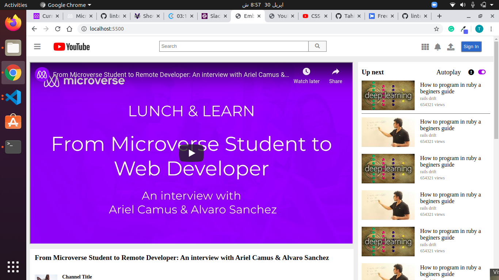

# Embedding Images and Video Project

> Youtube replica

The page tries to replicate as much as possible the actual YouTube page.

## Built With

- Html,
- CSS

## Live Demo

[Live Demo Link](https://rawcdn.githack.com/visva-dev/Microverse-Collaborative-project---Embedding-Images-and-Video/1ad737999240c40c5811b5aa25c7f84ba5719534/index.html)

## Authors

👤 **Author1**

- Github: [@visva-dev](https://github.com/visva-dev)
- Linkedin: [@Visvaldas-Rapalis](https://www.linkedin.com/in/visvaldas-rapalis-009797b9/)

👤 **Author2**

- Github: [@Mupa1](https://github.com/talhawaqar)
- Linkedin: [@mupa-nzaphila](https://www.linkedin.com/in/talha-waqar-977257145/)

## 🤝 Contributing

Contributions, issues and feature requests are welcome! Start by:

- Forking the project
- Cloning the project to your local machine
- `cd` into the Youtube-Replica project directory
- Run `git checkout -b your-branch-name`
- Make your contributions
- Push your branch up to your forked repository
- Open a Pull Request with a detailed description to the development branch of the original project for a review

## 📝 License

This project is [MIT](https://opensource.org/licenses/MIT) licensed.
